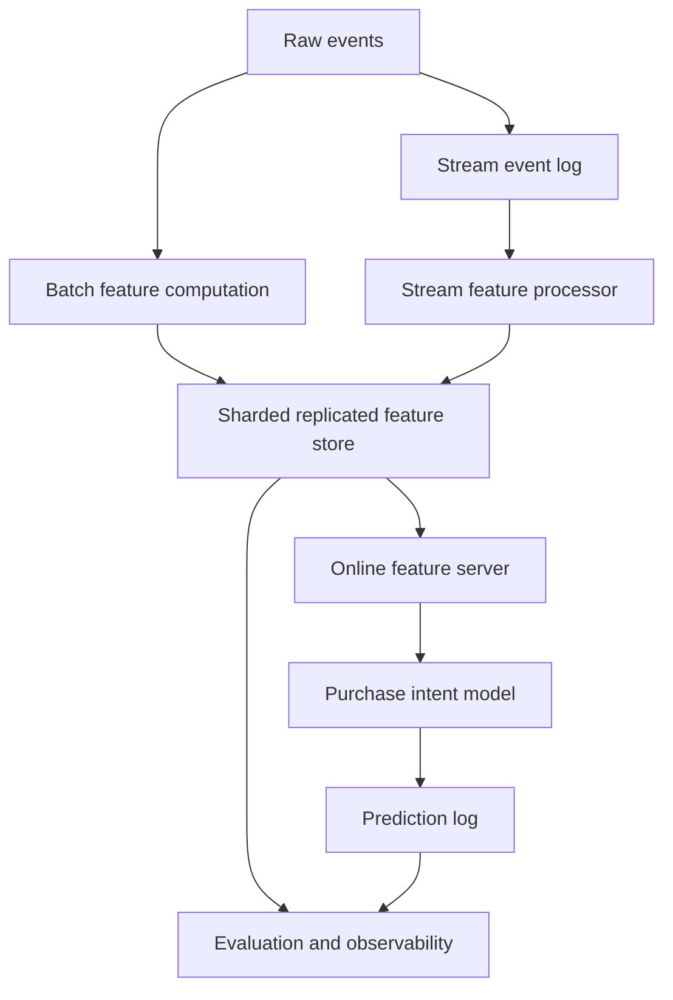

# MLStore-Lite Architecture

MLStore-Lite is a local educational prototype of a feature platform. It builds
from storage internals up to online model inference.

## System Flow



## Layers

### 1. Storage

One node stores key-value data using a write-ahead log, memtable, SSTable-like
files, and compaction. This is the local durability foundation.

### 2. Replication

Several local nodes keep copies of the same data using leader-follower
replication. Writes go through the leader and are copied to followers.

### 3. Sharding

The key space is split across shards using consistent hashing. Each shard is a
replicated group, so sharding divides keys while replication keeps copies.

### 4. Batch Processing

Historical events are processed with a small MapReduce-style flow:

```text
map -> shuffle -> reduce
```

The batch job writes user features such as click counts and purchase totals into
the sharded replicated store.

### 5. Stream Processing

New events are appended to a local event log, consumed with offsets, grouped
into tumbling windows, and written back as windowed features.

### 6. Integration

`MLStoreLiteSystem` wires together storage, replication, sharding, batch, and
stream processing so the project can run as one prototype.

### 7. Evaluation and Observability

Week 8 adds structured logs, timing measurements, and JSON-lines experiment
records. These do not make the system distributed; they make it inspectable.

### 8. Online Feature Serving and Inference

The AI extension reads stored features through a `FeatureServer`, runs a small
`PurchaseIntentModel`, and writes predictions to a JSON-lines log.

The AI layer consumes the earlier weeks. It does not replace them:

```text
batch/stream features -> feature store -> feature server -> model prediction
```

## Current Topology

The demos use:

- 2 shards: `shard-a`, `shard-b`
- RF = 3 per shard: 1 leader and 2 followers
- local directories as node storage
- no real network transport
- no automatic consensus or leader election

This keeps the implementation small enough to study while still showing the
core architecture of a larger data system.

## Scaling Thoughts

The project now includes local Week 10 experiments for workload scaling and
shard hotspots. These experiments do not make MLStore-Lite a production
distributed system, but they help show what would become important as workload
size and request skew grow.

For a possible cloud version of the same architecture, see:

```text
docs/cloud-architecture.md
```
