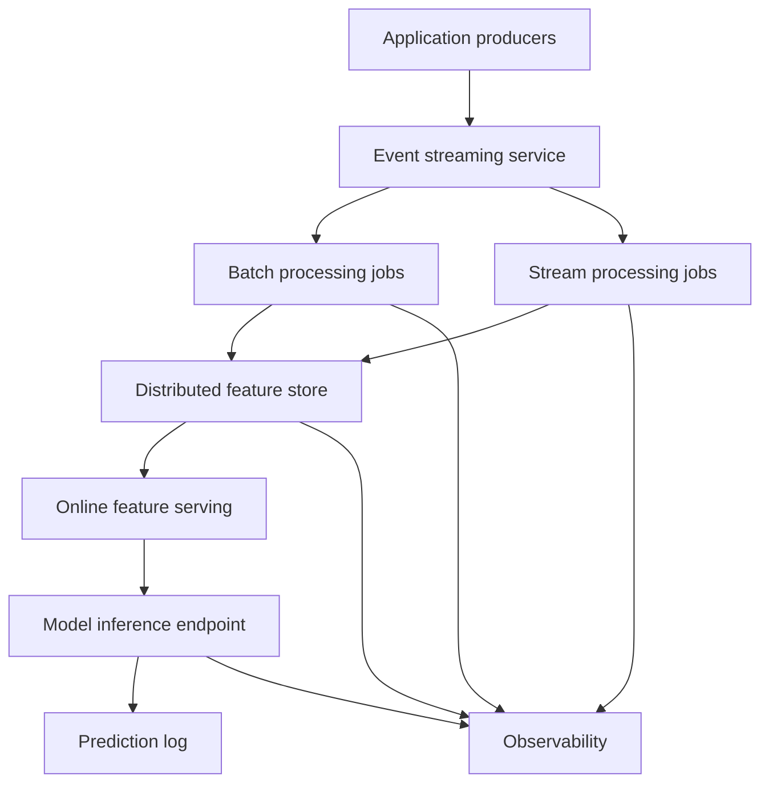

# Cloud Architecture Sketch

This document is a design sketch, not an implemented deployment.

MLStore-Lite currently runs locally with Python objects and local files. A cloud
version would keep the same conceptual layers but replace local components with
managed or distributed services.

## Cloud Flow

## Mapping From MLStore-Lite To Cloud Systems

| MLStore-Lite layer | Cloud-style equivalent | Role |
|---|---|---|
| `EventLog` | Kafka, Pub/Sub, Kinesis | durable event ingestion |
| `BatchEngine` | Spark, Databricks, Beam | historical feature computation |
| `StreamFeatureProcessor` | Flink, Kafka Streams, Dataflow | continuous feature updates |
| `ShardedCluster` | Cassandra, DynamoDB, Bigtable | partitioned online feature storage |
| `Cluster` replication | managed replication | fault tolerance and availability |
| `FeatureServer` | Feast or managed feature store serving | low-latency feature retrieval |
| `InferenceService` | model serving endpoint | online prediction |
| `ExperimentLog` / `PredictionLog` | MLflow, cloud logs, metrics, traces | observability and debugging |

## What Would Change

The main change would be operational. The local project simulates architecture
inside one process. A cloud version would run components independently:

- producers would send events over the network
- batch and stream jobs would run on workers
- the feature store would be a real distributed database
- inference would be served through an API
- logs and metrics would be collected centrally

This would introduce new problems that MLStore-Lite intentionally avoids:

- deployment
- service discovery
- network failures
- authentication
- schema evolution
- cost management
- production monitoring

## Why This Still Helps

The local project is useful because the same conceptual questions appear in the
cloud version:

- where is data stored?
- how is it replicated?
- how are keys partitioned?
- how are historical features recomputed?
- how are new events processed?
- how are features served to a model?
- how are measurements and predictions logged?

MLStore-Lite answers these questions in a small environment before adding cloud
complexity.
